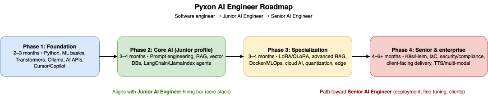
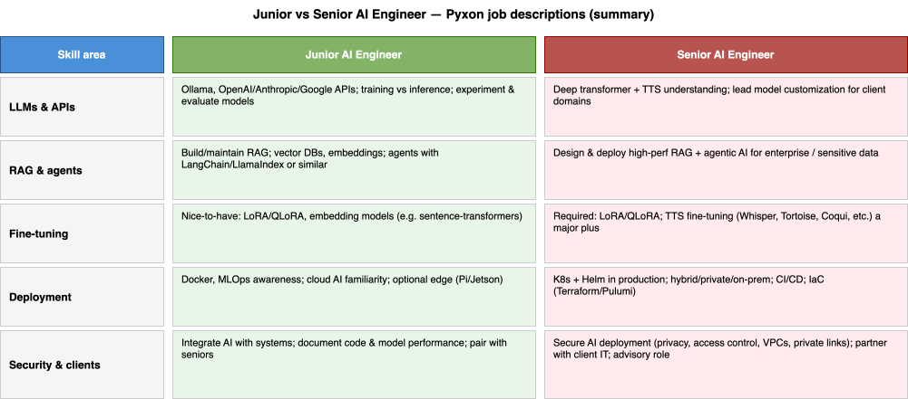
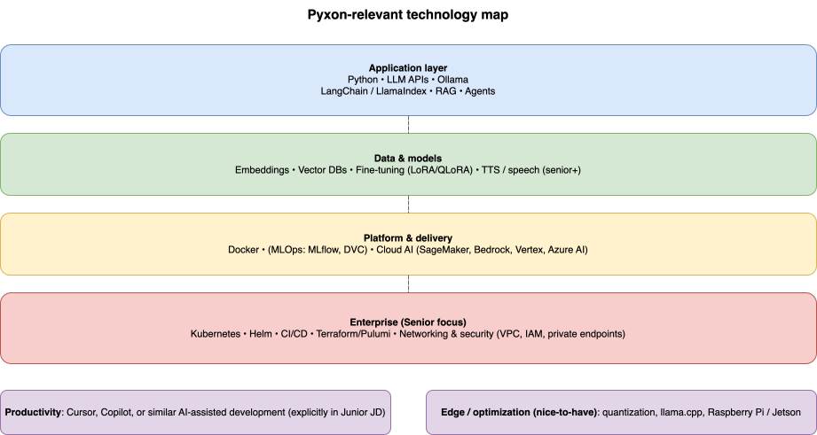

# AI roadmap for software engineers

A structured path toward **AI engineering** roles—with a focus aligned to **Pyxon-style** Junior and Senior expectations (see [ROADMAP.md](ROADMAP.md)).

**Learning roadmap:** [ROADMAP.md](ROADMAP.md)

---

## After the roadmap: projects

When you are ready to build a **portfolio piece**, open **[projects/README.md](projects/README.md)**:

- Choose **Junior** or **Senior**, then pick **one** project brief—[Junior](projects/junior/README.md) has **2** options; [Senior](projects/senior/README.md) has **3** (including **auto soccer commentary** with vision + LLM + TTS).
- Submit your work as a **pull request** under `projects/<track>/<your-project-folder>/`.
- Include a **`prompts/`** folder documenting how you used AI coding tools (Cursor, Claude Code, etc.) or your step-by-step process—see the [submission rules](projects/README.md#submission-rules).

---

## Diagrams

### Four-phase roadmap

### Junior vs Senior skills

### Technology map

